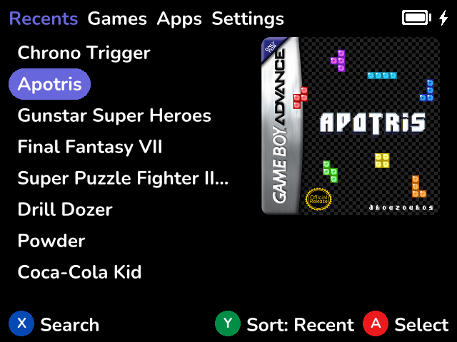

# Allium

Allium is a custom launcher for the Miyoo Mini and Miyoo Mini Plus handheld devices, similar to [OnionOS](https://github.com/OnionUI/Onion) and [MiniUI](https://github.com/shauninman/MiniUI).




## Project Goals

The goal of Allium is to replace MainUI (stock UI) with a faster and more user-friendly UI.

Goals:
- It just works
- Fast
- Clean UI
- RetroArch (with Netplay)
- Box art
- Support running on both Miyoo Mini and Miyoo Mini Plus without changes

## Installation

Download the latest release and extract into your SD card. e.g. `E:/`.

The SD card layout should look like this:
- .allium
- .tmp_update
- BIOS
- RetroArch
- Roms
- Saves

## Features
- Supports stock SD card layout without configuration
- Box art (PNG, JPG, GIF, TGA, BMP)
- Launch RetroArch for all supported cores
- Battery indicator
- Volume control
- In-game menu (view game name, battery %, save, load, reset, access RetroArch menu, quit)
- Automatic game save/resume when powering off/on

## Todo
(roughly in order of priority)
- Settings page:
    - Button colors
    - Theme color
    - Toggle box art
    - WiFi
    - Clock
- Persistent launcher state (maintain selected game after launching game/restarting)
- Recents list (sort by frecency)
- Brightness control
- File-system database to cache folder structure
- UI improvements:
    - Folder icon
    - Battery icon
    - Volume indicator
    - Brightness indicator
    - Error toast (e.g. no core found for game)
    - Anti-aliased circles
- WiFi stuff:
    - NTP
    - OTA update
    - Metadata/box art scraper
    - Cloud save sync
    - Seamless netplay from ingame menu

## Known bugs
- Volume resets when RetroArch launches
- Battery indicator draws over previous value

## Building

### Miyoo Mini (Plus)

[cross](https://github.com/cross-rs/cross) is used for cross-compilation.

```
cross build --release --target=arm-unknown-linux-gnueabihf
cp ./target/arm-unknown-linux-gnueabihf/release/allium <sdcard>
```

## Development

Allium comes with a simulator that can be used for development. The simulator requires SDL2 to be installed.

```
cargo run --target=x86_64-pc-windows-msvc
cargo run --target=x86_64-unknown-linux-gnu
```
