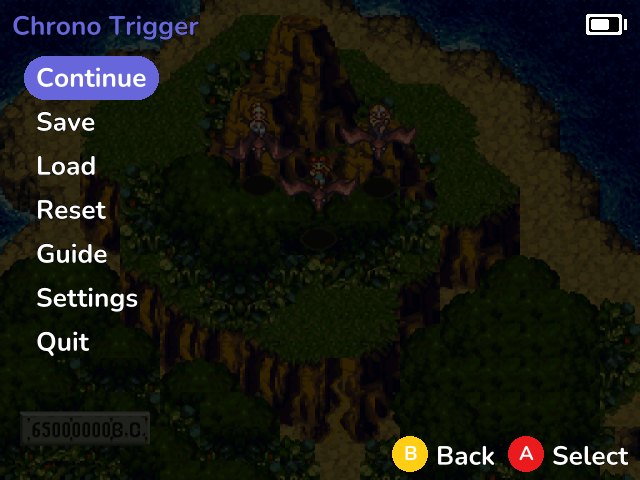

# Allium

Allium is a custom launcher for the Miyoo Mini and Miyoo Mini Plus handheld devices, similar to [OnionOS](https://github.com/OnionUI/Onion) and [MiniUI](https://github.com/shauninman/MiniUI).




## Installation

Allium only supports the Miyoo Mini Plus for now.

1. Format the SD card to [FAT32](https://github.com/anzz1/DotUI-X/wiki/fat32format).
2. Download the latest release and extract into your SD card. e.g. `E:/`.

The SD card layout should look like this:
- .allium
- .tmp_update
- BIOS
- RetroArch
- Roms
- Saves

## Features
- Supports stock/Onion/DotUI SD card layout
- Works without configuration
- Box art (PNG, JPG, GIF, TGA, BMP)
- Recents list (sort by last played or playtime)
- RetroArch for all supported cores
- Battery indicator
- Volume & Brightness (menu + vol up/down) control
- In-game menu (save, load, reset, access RetroArch menu, quit)
- Automatic resume when powering off/on
- Settings page
    - WiFi (IP Address, Telnet, FTP)
    - Change LCD settings
    - Customize theme colours

## Todo
(roughly in order of priority)
- Ingame menu disk changer
- Ingame guide reader
- Clock adjustment
- WiFi stuff:
    - NTP
    - OTA update
    - Metadata/box art scraper
    - Cloud save sync
    - Seamless netplay from ingame menu
- UI improvements:
    - Folder icon
    - Battery icon
    - Volume indicator
    - Brightness indicator
    - Error toast (e.g. no core found for game)
    - Anti-aliased circles
- Theme manager
    - Built-in themes
    - Save current theme to file
- File-system database to cache folder structure

## Known bugs
- Brightness in settings is not linked to menu+vol hotkey adjustments

## Development

Allium comes with a simulator that can be used for development. The simulator requires SDL2 to be installed.

### Requirements
1. `make`, `cargo`
2. [SDL2](https://github.com/Rust-SDL2/rust-sdl2#sdl20-development-libraries) (optional, if simulator is not used)
3. [cross](https://github.com/cross-rs/cross): `cargo install cross --git https://github.com/cross-rs/cross` (optional, for cross-compilation)

### Simulator
```
# Run main menu (allium-launcher)
make simulator-launcher

# Run ingame menu (allium-menu)
make simulator-menu
```

### Building

Running `make` will build Allium and RetroArch, then copy the built and static files into `dist/`.
```
make all
cp -r dist/. <sdcard>
```
